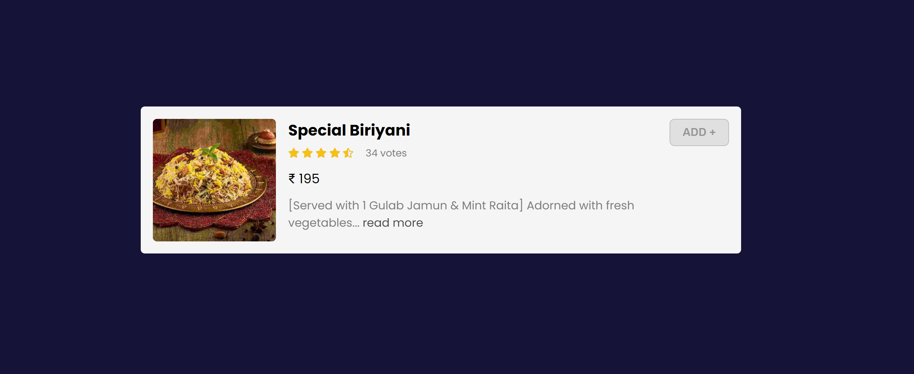

# Learn-BEM-CSS-Tamil

Learn about BEM in-detail with clear practical examples in Tamil. Video, PPT, Adobe XD file all are available to download.

#### Screenshots (What we gonna learn at the end!)

### Learn it by practice: [CyberDude YouTube](https://www.youtube.com/user/CyberDudeNetworks)

#### Supporting files includes:

- [PPT file](https://raw.githubusercontent.com/anburocky3/BEM-CSS-Tamil/main/supporting-files/CSS-BEM.pptx)
- [Adobe XD File](https://raw.githubusercontent.com/anburocky3/BEM-CSS-Tamil/main/supporting-files/Learn-BEM-CSS-overview.xd)
- Source codes

#### Authors:

- Anbuselvan Rocky ([Facebook](https://fb.me/anburocky))

#### License - MIT
